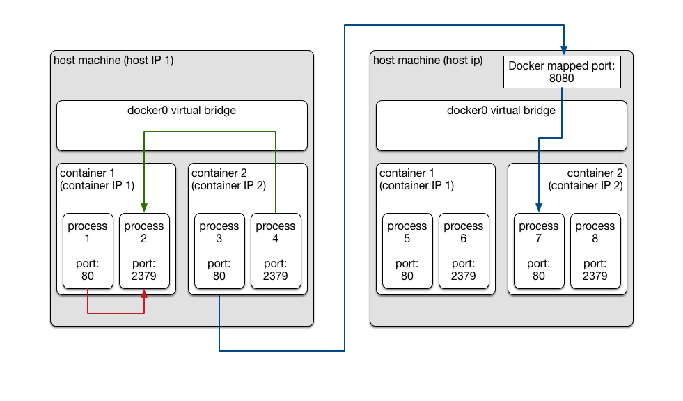

# 从裸机和虚拟机到Docker和Kubernetes

Kubernetes是一个分布式操作系统，它能调度很多Docker containers。分布式系统的核心在网络和通信。要理解Kubernetes如何处理网络，最好从分布式系统的网络演进入手，知其然知其所以然。

## Bare Metal Network

最简单粗暴的分布式计算就是在几台机器（bare metal computer）上启动一些进程，让它们之间可以通信。这里有两个概念：

1. 节点（node），和
1. 进程（process）

其中节点也叫主机（host），因为进程是客人。

一个进程A要连上另一个进程B的时候，得知道B的网络地址。在TCP/IP网络里，每台机器有一个IP地址，同一台机器上不同的进程（线程）可以监听不同的端口（port），于是一个进程（线程）可以用一个IP地址加上一个port来定位，这就是网络地址（network address）。

- 同一台机器上进程互联的时候可以用特殊的loopback IP 127.0.0.1。操作系统的网络驱动程序处理和127.0.0.1上的某个port的通信的时候，是不调用网卡驱动程序的，这样效率很高。下图中 process 1 连接 process 2 时就可以用网络地址`127.0.0.1:2379`。

- 跨host的访问，比如process 3连接process 8，的时候就需要目标 host 的IP地址了。各个host的IP地址通常是网络中一个DHCP服务来统一分配的。通常DHCP服务运行在路由器上。


当我们启动一个分布式作业（job）的时候，我们会在很多机器上启动很多进程。首先我们得确保新启动的进程的port和那台机器上已有的进程的port不重复；然后我们还得让一个作业中所有进程互相知道对方的网络地址。

第一个问题好解决：当一个服务进程要监听一个port时，它可以调用操作系统的Listen功能调用，并且指定port。比如Go语言标准库对操作系统Listen功能调用的封装是[net.Listen](https://golang.org/pkg/net/#Listen):

```
l, e := net.Listen("tcp", 0)
```

注意，当port是0时操作系统会分配一个空闲端口。这个端口加上本机IP构成的网络地址是：

```
l.Addr().String()
```

第二个问题也有解法：每个进程启动的时候，接受一个命令行参数，给这个进程指定一个名字；进程在调用Listen并且获取了port之后，把自己的名字和网络地址告诉机群上的一个公共服务，比如[etcd](https://github.com/coreos/etcd)，从而公示自己的网络地址，让其他进程可以连接自己。

但是一个最基本的问题并没有解决：在哪些机器上启动哪些进程？在一个小团队里，这个问题可以靠人和人协调：问问大家都在用那几台机器，从而找出相对空闲的几台，随后手工地把一个job里的多个进程分配到这几台机器上，利用ssh命令启动进程。

但是当人多了或者机器多了的时候，就得靠专门的软件来自动调度了。这时，一个进程可能被运行在机群中任何一台机器上。这就引发出*部署（deploy）*的问题了。每个分布式程序有各自的依赖：有的需要Python 2.4，有的需要Python 2.6，有的需要Python 3.1。还有的需要特定版本的Java、Ruby、Lua、甚至GCC runtime library。如此缤纷，以至于没法在一个机群的所有机器上预先安装所有的依赖。这可怎么办？

一个直观的解法是把一个程序和它所有的依赖都预先安装在一个虚拟机镜像里。然后在需要启动程序的机器上运行一个虚拟机。

## 虚拟机

相对于上一节介绍的bare metal network，虚拟机是一个新概念：

1. 真实节点（bare metal node），
1. 虚拟机（virtual node），和
1. 进程（process）

其中真实节点也被称为host，而虚拟机也被称为guest。

一个host上安装的虚拟机管理系统（比如VirtualBox和VMware）会运行一台或者多台guest，每个guest里运行一个guest操作系统（guest OS）和多个应用程序的进程。一个很自然的问题是：guest的IP地址如何分配？

大多数虚拟机管理系统提供两种IP地址分配方式：

1. *Bridged*：虚拟机管理系统把IP地址分配的问题移交给host所在网络的IP地址分配机制（通常是host网络的路由器）。这样一来，每一个guest的IP地址和host一样，都是host网络的路由器分配的。启动一台guest，就像在网络里增加了一台机器一样。它的好处是管理很简单，因为host里的进程和guest里的进程都可以互相通信。坏处也很明显，一个物理网段里可以用的IP地址数量是有限的，所以bridged方式下，一个机群里能启动的guest的总数是有限的。

1. *NAT（network address translation）*： NAT模式下，每台host上的虚拟机管理系统虚拟一个“路由器”，负责给本host上的各个guest分配IP地址。因为guest IP和host IP不是同一个网段了，所以如果某个host里的进程要访问另一个host里某个guest里的进程的时候，要把目标guest的IP地址“翻译”成目标host的IP地址。这是NAT的名字的来历。知得注意的是：当各个host上都用NAT方式给guest分配IP的时候，在不同host上的多台guest的IP地址可能相同。

下图展示了NAT networking model：


- 当一个进程要访问同一个guest里的另一个进程的时候，比如图中process 1要访问process 2的时候，可以用`localhost`网络地址。

- 当跨guest但是不跨host的时候，用目标guest的guest IP定位目标进程。比如图中process 4访问process 2。

- 当跨越host访问的时候就麻烦一些了：需要访问目标host的IP和host上的某个端口（图中所示8080），然后目标host上的虚拟机管理系统要能把host上8080端口映射到预先指定的VM 2中的80端口，这样对`host-IP-2:8080`的访问就被转发给host 2上的VM 2里的process 7了。这就叫*端口转发*（port foward）。

## Docker

Docker的网络通信设计和虚拟机类似。Docker和虚拟机的主要区别在于：Docker不虚拟CPU和硬件，也不需要在虚拟硬件上运行guest OS。说实话，仅仅为了把程序及其依赖打个包方便部署，实在不需要虚拟机。

[这篇文档](http://kubernetes.io/docs/admin/networking/#docker-model)描述了Docker的网络模型。下图更直观：



- 和NAT模式下，每个host上的虚拟机管理系统虚拟一个路由器类似，Docker里有一个虚拟网桥`docker0`来负责给各个Docker container分配container IP。每一个container里有一个虚拟网卡`eth0`，和`docker0`连接。`docker0`分配的IP赋给了每个container的`eth0`。

- 同一个container里的各个进程之间互相访问可以利用`localhost` IP。

- 同一个host上不同container里的进程互访可以用同一个虚拟网桥下的container IP。比如图中process  4访问process 2时，process 2的网络地址是`container-IP-1:2379`。

- 跨host的通信需要端口转发（port forward）。这和使用虚拟机的时候是类似的。比如图中process 3访问processs 7时，process 3连接的目标网络地址是`host-IP-2:8080`，其中 host 2上的8080端口被配置为转发到container 2里的80端口。

## Kubernetes

用虚拟机和Docker来组织分布式计算都有一个共同的麻烦：端口转发。

当开发人员创建虚拟机镜像和Docker image的时候，是可以指定每个进程的局部（虚拟机内和container内）port的 。但是要支持跨host访问，还需要把这些局部端口映射到host端口。而映射到host上哪个端口，依赖当前恰好在host上执行的虚拟机或者container。

一个简单而且彻底的解决方法是要求机群上执行的所有程序都接受一个命令行参数，比如`--port=`，来指定进程监听的端口号；并且机群管理系统（比如Kubernetes或者Mesos或者YARN）在启动进程的时候，通过`--port`指定给进程一个端口号。但是很多常用程序，比如MySQL和nginx，都并不遵从这样的协议。很多进程会启动多个线程，同时监听多个端口。所以Kubernetes的设计得另寻出路。

虚拟机和Docker的麻烦在于有host IP和局部IP（guest IP和container IP）两层IP地址，所以跨host访问的时候，得用host IP然后端口转发给局部；而不跨host的时候，得用局部IP。所以Kubernetes的思路是，要做到即便是跨host访问，也只需要“局部IP”。换句话说，“局部IP”不能局限在host里，而是要机群里所有host上的所有container共享一个IP地址空间。这其实有点儿像上文中提到的bridged方式，只是把虚拟机换成了container。和bridged方式的另一个不同点是：我们不需要在机群的router管理的物理网段里分配IP，而是在一个虚拟router管理的网段里分配，而这个网段可以很大，从而容纳很多containers。

要是能这样当然就解决问题了。可惜的是，如上文所说，Docker有自己的networking model，在每台host上有虚拟网桥`docker0`，做不到Kubernetes想要的不同host上的所有container共享一个网络地址空间。为此，Kubernetes只好在host和container之间，引入一层*Pod*，然后利用一个全机群通用的IP地址分配机制，给每个Pod分配IP地址，而Pod里的所有container都用这个Pod的IP地址。


